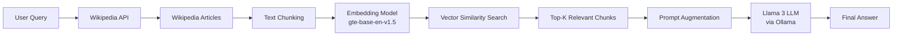

# 🦙 Llama3 RAG Wiki

**Retrieval-Augmented Generation (RAG) with Llama 3 and Wikipedia | Local Open-Source LLM Chatbot**


---

## 🔍 What is Llama3 RAG Wiki?

**Llama3 RAG Wiki** is a **local, open-source Retrieval-Augmented Generation (RAG) chatbot** built using **Llama 3**, **Ollama**, and **Wikipedia**.

It demonstrates how to:

* Combine **LLMs + semantic search**
* Reduce hallucinations using **external knowledge retrieval**
* Build a **fully local RAG pipeline**
* Implement **bare-bones-style RAG** in Python

This project is ideal for **LLM engineers, AI researchers, students, and open-source contributors** looking to understand or build RAG systems from scratch.

---

## ✨ Key Features

* 🧠 Local **Llama 3 (8B)** inference via Ollama
* 📚 Real-time **Wikipedia-based knowledge retrieval**
* 🔍 Semantic search using **Sentence Transformers**
* 🧩 Modular RAG architecture
* 📓 Step-by-step **Jupyter Notebook tutorial**
* 🖥️ Standalone **Python CLI application**
* 🔓 100% open-source and offline-friendly

---

## 🏗️ RAG Architecture Overview

This project follows a standard **Retrieval-Augmented Generation** pipeline:

1. User submits a query
2. Relevant Wikipedia articles are retrieved
3. Text is chunked and embedded
4. Semantic similarity search selects top context
5. Context is injected into the LLM prompt
6. Llama 3 generates a grounded response

### Architecture Diagram



---

## 📘 Learn More

📖 **LinkedIn Article:**
A beginner-friendly explanation of LLMs and RAG architecture:

👉 [Explain LLM + RAG Like I’m 5](https://www.linkedin.com/pulse/explain-llm-rag-like-im-5-mahmood-mohammed-dfrfc/?trackingId=33mqDzrrRPe4fAekiIwNSg%3D%3D)

---

## 🔄 Project Variants

The repository includes **two implementations**:

### 📓 Jupyter Notebook

* Step-by-step explanation of RAG internals
* Ideal for learning and experimentation

### 🖥️ Python Application

* End-to-end local RAG chatbot
* Suitable for real-world usage and demos

---

## 🧠 Models Used

| Component  | Model                          |
| ---------- | ------------------------------ |
| LLM        | Llama 3 (8B)                   |
| Embeddings | `Alibaba-NLP/gte-base-en-v1.5` |

---

## 📦 Dependencies

* **ollama** – v0.2.1
* **sentence-transformers** – v3.0.1
* **numpy** – v1.26.4
* **Wikipedia-API** – v0.6.0

---

## ⚙️ Installation & Setup

### Prerequisites

* Python 3.9+
* Ollama installed locally

### Pull Required Models

```bash
ollama pull llama3
ollama pull llama3.1
```

### Run the Application

```bash
python Llama3_RAG_Wiki.py
```

---

## 🎯 Use Cases

* 🧪 Learning Retrieval-Augmented Generation
* 🤖 Building local AI chatbots
* 📚 Question answering over external knowledge
* 🛠️ LLM system design experimentation
* 🎓 AI education & workshops

---

## 🌱 Future Enhancements

* Vector database integration (FAISS / Chroma)
* Multi-document retrieval
* Query rewriting and reranking
* Streaming responses
* Web-based UI

---


## ⭐ Why This Repo Matters

* Demonstrates **real-world RAG implementation**
* Uses **state-of-the-art open-source LLMs**
* Runs **entirely on your local machine**
* Beginner-friendly yet production-aligned

If this project helped you, please consider giving it a ⭐!

---

